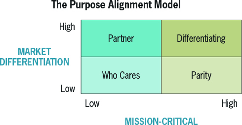

# Build vs Buy

## Quick Hitters

- Do you want your process to conform to the tool, or your tool to conform to the process?
- Is it a core competency or a way to stand out in the market for you? See below to help figure this out.

## Purpose Based Alignment Model

### Who Cares Quadrant - Low Mission Critical and Low Market Differentiation

These functions are ones with Low Market Differentiation and are not Mission Critical. These are to be performed as little as possible and be given as little attention as possible.

### Parity Quadrant - High Mission Critical and Low Market Differentiation

The purpose of this quadrant is simply to keep up with the marketplace. It does not generate a competitive advantage if you do it better than your competitors, however these are mission critical activities so you want to make sure you do not under invest.

These are ideal candidates for streamlining and simplifying, because complexity means you're over investing.

### Partner Quadrant - Low Mission Critical and High Market Differentiation

Some activities aren't mission critical for your org, but CAN differentiate the organization. You'll want to find a partner who is differentiating on these activities and work with them to create this differentiation.

### Differentiating Quadrant - High Mission Critical and High Market Differentiation

These activities are and should be your organization's claim to fame. These activities directly link to strategy and you should focus your creativity on these processes.
