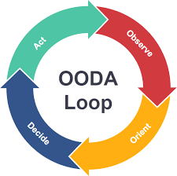

# OODA Loop

4 Step approach to decision making that focuses on filtering available information, putting it into context, and making the appropriate decision while also understanding that changes can be made as more data becomes available.

### Observe

- Gather information quickly
- Observe interaction with environment and circumstances

### Orient

- Make sense of the information
- Understand cultural traditions, prior experiences, etc.
- Spot errors in thinking
- Orient to take advantage of these gaps

### Decide

- Decide which option(s) to select. Form a hypothesis.

### Act

- Implement your decision and test your hypothesis
